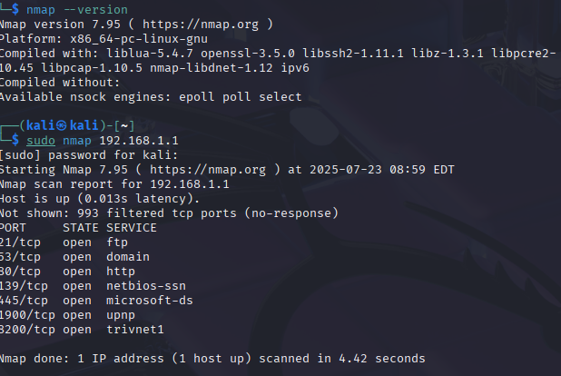
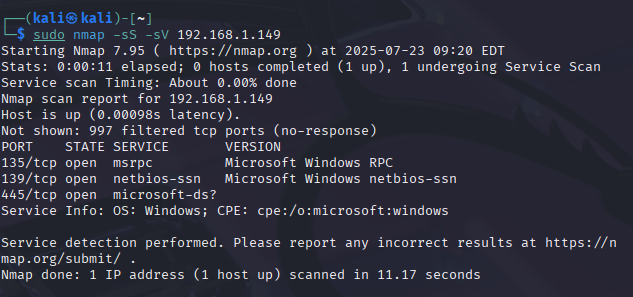
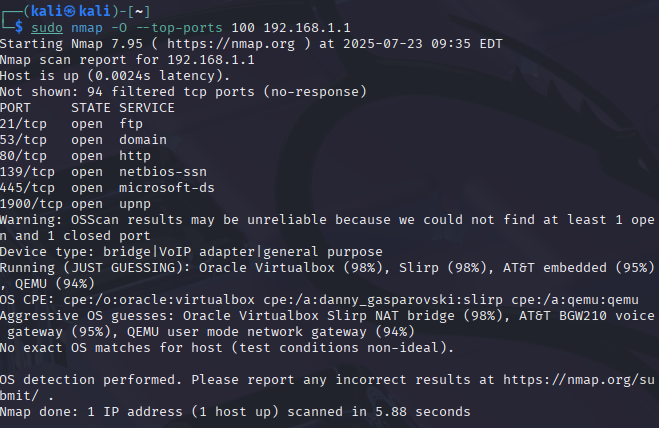
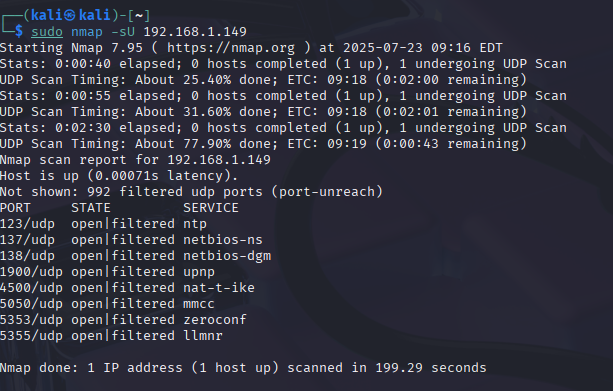

# Project_2 Walkthrough — Nmap & Wireshark Lab

## Step 1: Scanning My Router with Nmap

To start this lab, I wanted to understand how to use nmap on a real device in my home network. I chose to scan my router (192.168.1.1) to see what services were exposed internally.  

**Command Used:**  
`sudo nmap 192.168.1.1`  

This is the most basic Nmap scan — it checks the top 1000 TCP ports using the default scan type (SYN scan when run with root/sudo).

**Purpose:**  
To identify what services and ports are open on my home router. This is a real-world scenario: internal reconnaissance is a common technique used by both attackers and defenders during network assessments.

**Outcome:**  
The scan showed 7 open ports:

| Port  | State | Service     |
|-------|-------|-------------|
| 21    | open  | ftp         |
| 53    | open  | domain      |
| 80    | open  | http        |
| 139   | open  | netbios-ssn |
| 445   | open  | microsoft-ds|
| 1900  | open  | upnp        |
| 8200  | open  | trivnet1    |

**What I Learned:**  
This scan gave me a basic idea of what services are exposed on my local network. Some ports stood out to me:

- **FTP (21):** Used for file transfers — I’ll try checking if anonymous login is allowed.
- **HTTP (80):** There’s probably a web interface running here.
- **139 and 445 (NetBIOS and SMB):** These are often used for Windows file sharing. I noted them down for deeper enumeration later.
- **UPnP (1900):** Might be useful for discovering devices on the network.
- **Port 8200 (trivnet1):** Associated with Bomgar, a remote support and access tool. Specifically, it's used as a backup/rollover port for port 443.

## Step 2: Scanning a Windows Device on My Network
After scanning my router, I wanted to try scanning another device on my network — my Windows PC. This helps simulate a real-world scenario where a security professional (or attacker) is probing other machines in the local network for open services.

### 1. TCP SYN Scan with Version Detection

**Command Used:**
`sudo nmap -sS -sV 192.168.1.149`

**Purpose:**
This command runs a TCP SYN scan (`-sS`) and includes service/version detection (`-sV`). The goal is to see which TCP ports are open and what services are running on them, along with their versions if possible.

**Outcome:**
Three ports were found open:

- **135/tcp** → Microsoft Windows RPC

- **139/tcp** → NetBIOS Session Service

- **445/tcp** → Microsoft Directory Services (SMB)

**What I learned:**
These ports are typical of Windows file and printer sharing features:

- Port 135 is used by RPC, often part of DCOM services.

- Ports 139 and 445 are tied to SMB/NetBIOS — common targets during lateral movement and enumeration.

- The OS fingerprint also suggested the device is a Windows machine, which confirms the target.

### 2. OS Detection + Top 100 TCP Ports

**Command Used:**
`sudo nmap -O --top-ports 100 192.168.1.149`

**Purpose:**
To scan the 100 most common TCP ports and attempt to detect the target's operating system.

**Outcome:**
Same open ports as before: 135, 139, and 445.
The OS detection guessed it was running Windows — which was accurate.

**What I learned:**
OS detection is useful for tailoring attacks or defenses, especially if trying to identify Windows vs Linux targets.

### 3. UDP Scan – Top 100 UDP Ports

**Command Used:**
`sudo nmap -sU --top-ports 100 192.168.1.149`

**Purpose:**
To check which UDP services might be open. UDP scans are slower and trickier but can reveal services not visible in TCP scans.

**Outcome:**

- **137/udp:** open|filtered → netbios-ns

- **5353/udp:** open|filtered → zeroconf (Multicast DNS / mDNS)

**What I learned:**

- Port 137 is used in Windows name resolution and NetBIOS name service.

- Port 5353 is used for local network discovery (mDNS), common on modern Windows or macOS systems.

- These are useful from a blue-team perspective to harden exposed services.
